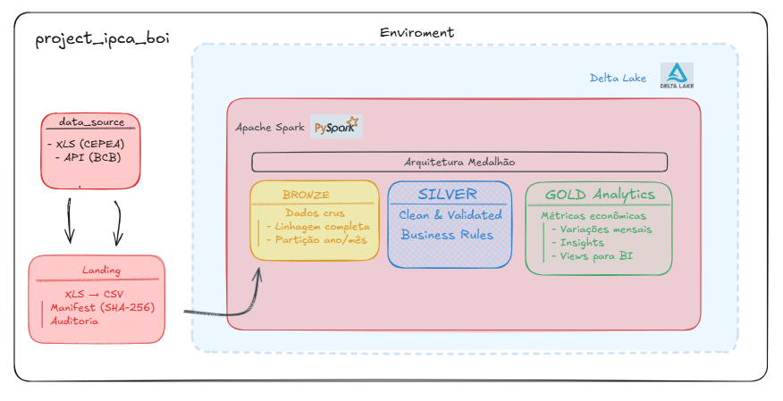

## ETL com IPCA e Commodity Boi Gordo (Arquitetura Medallion - Delta Lake)

# 📊 ETL de IPCA e Boi Gordo


*Pipeline ETL desenvolvido para ingestão, padronização e versionamento de dados econômicos (IPCA e Boi Gordo), utilizando **Apache Spark**, **Delta Lake** e **Python** em ambiente local (Windows).*

---

## 🗂️ Estrutura do Projeto

```text
etl-ipca-boi-gordo/
│
├── data_source/
│     ├── csv/                     # Arquivos brutos (.json)
│     └── xls/                     # Arquivos brutos (.xls)
│
├── docs/     
│
├── lakehouse/
|     |  └── bronze/               # Tabelas Delta (Camada Bronze)
|     |        └── boi_gordo/
|     |        └── IPCA/               
│     ├── Silver/                  # Tabelas Delta ( Silver Transformations )
|     |      └── boi_gordo/
|     |      └── IPCA/
|     |                        
│     └── Gold/                    # Tabelas Delta (Gold Analytics)
|           └── analitico/
│           └── boi_ipca/
|           └── insights/
|
├── Notebooks/
|        └── 01_validacao_bronze.ipynb
|        └── 02_transform_silver.ipynb
|        └── 03_analytics_gold.ipynb
├── src/
│    │
│    └── bronze/
│           ├── ingest_bronze_delta.py 
│           └── ingest_ipca_bcb_bronze_delta.py
│           └── ingest_xls.py
|
├── .gitignore
├── requirements.txt
└── README.md
```

### Compatibilidade de Versões — Apache Spark

*Este documento descreve as **versões recomendadas e compatíveis** para executar o Apache Spark de forma estável, especialmente em ambientes Windows com Python (ETL / Data Engineering).*

---

### Versões Recomendadas (Stack Estável)

### Java (Obrigatório)

*O Apache Spark **depende diretamente da JVM**. Nem toda versão do Java é compatível.*

| Java | Status | Observações |
|-----|-------|-------------|
| Java 11 (LTS) | Recomendado | Mais usado em produção |
| Java 17 (LTS) | Recomendado | Compatível e estável |
| Java 8 | Legado | Funciona, mas não recomendado para novos projetos |
| Java 21+ | Não suportado | Pode falhar silenciosamente |
| Java 25 (LTS) | Incompatível | Spark trava ao iniciar (sem erro claro) |

📌 **Recomendação oficial**:  
> Use **Java 11 ou Java 17** para evitar travamentos na inicialização do Spark.

---

### 🐍 Python (PySpark)

| Python | Status |
|------|--------|
| Python 3.9 | Suportado |
| Python 3.10 |  Recomendado |
| Python 3.11 |  Parcial |
| Python 3.12 |  Problemas frequentes |

📌 **Recomendação**:  
> Utilize **Python 3.10** para máxima compatibilidade com PySpark, Pandas e PyArrow.

---

## ⚡ Apache Spark

| Spark | Java Compatível |
|------|----------------|
| Spark 3.4.x | Java 8, 11, 17 |
| Spark 3.5.x | Java 11, 17 |

---

📌 Spark **não está preparado** para Java ≥ que a versão 21 no momento.

---

### 🧱 Stack Recomendada para ETL (Bronze / Silver / Gold)

```
Python 3.10
Java 17 (LTS)
Apache Spark 3.5.x
Delta-spark 3.5.1
Conda / venv
Windows ou Linux
```
### Pipeline de ingestão de dados XLS -> CSV

```
etl-ipca-boi-gordo/
│
├── data_source/
│   └── xls/
│       └── cepea-consulta-20260131203157.xls
│
├── ingest_xls.py   


data_source/
├── xls/
│   └── cepea-consulta-20260131203157.xls
│
└── csv/
    ├── cepea-consulta-20260131203157.csv
    └── _manifest.csv
```

O `_manifest.csv` vai registrar:

- hash do arquivo
- nome do XLS original
- CSV gerado
- timestamp UTC

> Se você rodar de novo, ele não reconverte o mesmo arquivo (dedupe por hash)

Para execução: 

`python src\bronze\ingest_xls.py`


## Pipeline inicial (extração → transformação → pronto para Bronze)

### 1) Extração (landing / data_source/xls)
- Objetivo: coletar os arquivos `.xls/.xlsx` brutos exatamente como chegam da fonte (sem alterar conteúdo).
- Local: `data_source/xls/`
- Benefício: mantém o “dado original” para auditoria e reprocessamentos.

---

### 2) Transformação canônica (XLS → CSV padronizado)
- O script lê a primeira planilha do XLS e mantém apenas as **2 primeiras colunas** (data e valor).
- Remove linhas de cabeçalho/observação (“linhas lixo”) e padroniza o dataset para um formato único:
  - `mes_ano` no padrão `MM/YYYY`
  - `valor` como número (`float`), normalizando pt-BR (ex.: `1.234,56` → `1234.56`)
- Saída gerada em: `data_source/csv/<nome_do_arquivo>.csv`

**Estrutura final do CSV:**
- `mes_ano` (string `MM/YYYY`)
- `valor` (float)

---

### 3) Controle de ingestão (dedupe por hash + manifest)
- Antes de converter, o pipeline calcula o **SHA-256** do arquivo XLS.
- Se o hash já existir no `_manifest.csv`, o arquivo é ignorado (evita reconversão e duplicidade).
- Se for novo, converte e registra no manifest:

Arquivo: `data_source/csv/_manifest.csv` registra:
- `file_hash` (sha256 do XLS/XLSX)
- `source_file` (nome original do XLS)
- `csv_file` (CSV gerado)
- `converted_at_utc` (timestamp UTC)

---

### 4) Pronto para a camada Bronze (Spark + Delta)

- Resultado: CSVs **limpos e padronizados** em `data_source/csv/`, ideais para leitura no Spark.
- Próximo passo (Bronze): o Spark lê esses CSVs e grava em Delta adicionando colunas técnicas, por exemplo:
  - `source_file` (origem do dado)
  - `file_hash` (chave de dedupe/linhagem)
  - `ingested_at` (timestamp de ingestão)
> Assim, a Bronze fica rastreável, reprocessável e com linhagem completa.


## Pipeline Bronze (Delta Lake)

```ingest_bronze_delta.py```

### Objetivo:

Ingerir os dados **CSV** (`data_source/csv`) para a **camada Bronze** do lakehouse em **formato Delta**, garantindo rastreabilidade, idempotência e base sólida para Silver/Gold na arquitetura medalhão.

---

### Papel na arquitetura medalhão:

- **Data Source**: dados já normalizados (CSV).
- **Bronze (este arquivo)**: persistência confiável em Delta, com histórico e linhagem.
- **Silver/Gold**: camadas futuras para regras de negócio e agregações.

---

## Fluxo do pipeline

1. **Inicialização do Spark**
   - Cria `SparkSession` com **Delta Lake habilitado** (`configure_spark_with_delta_pip`).
   - Define timezone UTC e configs básicas de execução.

2. **Leitura do manifest**
   - Lê `_manifest.csv`, que registra:
     - `file_hash`, `source_file`, `csv_file`, `converted_at_utc`
   - O manifest é a fonte de verdade para **controle de ingestão**.

3. **Idempotência por hash**
   - Verifica se a tabela Delta Bronze já existe.
   - Compara os `file_hash` do manifest com os já presentes na Bronze.
   - Só processa arquivos **ainda não ingeridos**.

4. **Leitura dos CSVs**
   - Lê todos os CSVs novos de uma vez, com **schema explícito**.
   - Evita inferência instável de tipos.

5. **Enriquecimento com linhagem**
   - Faz join com o manifest para adicionar:
     - `source_file`
     - `file_hash`
     - `converted_at_utc`
   - Acrescenta colunas técnicas:
     - `ingest_run_id`
     - `ingested_at_utc`

6. **Derivação de partições**
   - Extrai `ano` e `mes` a partir de `mes_ano`.
   - Usadas para **partitioning** da tabela Delta.

7. **Checagens de qualidade mínimas**
   - Valida formato de `mes_ano` (`MM/YYYY`).
   - Garante que colunas de linhagem não sejam nulas.
   - Bronze aceita imperfeições, mas não aceita “lixo”.

8. **Gravação na Bronze (Delta)**
   - Remove duplicidades defensivas (`mes_ano + file_hash`).
   - Escreve em modo `append` no path da tabela Delta.
   - Particiona por `ano` e `mes`.

---

## Resultado final:
- Tabela Delta em: `lakehouse/bronze/boi_gordo/`

> Com:

- Histórico completo
- Linhagem por arquivo
- Idempotência garantida
- Pronta para consumo pela camada Silver

---

## Benefícios de engenharia:

- Evita reprocessamento acidental
- Facilita auditoria e reprocessos
- Isola instabilidades da fonte
- Escala naturalmente para novos datasets (IPCA, boi gordo, etc.)

Este arquivo é o **pilar da camada Bronze** do projeto.

```
lakehouse/
└── bronze/
    └── boi_gordo/
        ├── _delta_log/
        └── ano=2025/
            ├── mes=01/
            ├── mes=02/
            └── ...


- Dessa forma temos o Delta Lake está corretamente habilitado.
- Particionada por ano e mês.
- O pipeline idempotente (rodar de novo não duplica)
- Design está alinhado à arquitetura medalhão
 ```           

## Ingestão Bronze — Pipeline IPCA (BCB/SGS) em Delta Lake

O script (`src/bronze/ingest_ipca_bcb_bronze_delta.py`) extrai o IPCA diretamente da API pública do Banco Central (SGS) e grava os dados na camada **Bronze** do lakehouse em **formato Delta**, seguindo o padrão da arquitetura medalhão (Bronze → Silver → Gold).

### O que ele faz:

- Faz **fetch** da série do IPCA via API BCB/SGS (por `SERIES_ID` e intervalo de datas).
- Converte e tipa os campos:
  - `data_ref` (date)
  - `valor` (double)
- Adiciona colunas técnicas de **linhagem/auditoria** (`source`, `series_id`, `request_url`, `ingest_run_id`, `ingested_at_utc`).
- Aplica **idempotência** via `payload_hash` (SHA-256 do payload retornado): se o mesmo conteúdo já foi ingerido, não reprocessa.
- Grava em **Delta Lake** com partição por `ano` e `mes`:
  - `lakehouse/bronze/ipca/_delta_log`
  - `lakehouse/bronze/ipca/ano=YYYY/mes=MM`

### Pré-requisitos:

- Ambiente Python ativo (ex.: `conda activate env_ipca_boi_2`)
- Dependências instaladas: `pyspark` e `delta-spark` (**Versões específicas**)

### Execução:

Na raiz do projeto:

```
python src/bronze/ingest_ipca_bcb_bronze_delta.py
```

## Fonte de Dados – CEPEA (Contexto Técnico e Decisão de Engenharia)

Os dados de preço do boi gordo utilizados neste projeto têm como fonte a **CEPEA/USP** (Centro de Estudos Avançados em Economia Aplicada), uma instituição acadêmica amplamente reconhecida no Brasil.

Entretanto, a CEPEA não disponibiliza uma API pública para consumo automatizado de seus dados. O acesso é voltado prioritariamente ao consumo humano via navegador, com disponibilização controlada de arquivos (ex.: XLS).

## 🏛️ Fonte oficial

Instituição: Banco Central do Brasil
API: SGS
Série IPCA mensal (%): 433
Endpoint com filtro por data:

https://api.bcb.gov.br/dados/serie/bcdata.sgs.433/dados


## Mecanismos de Segurança do Site da CEPEA

O site da CEPEA utiliza mecanismos modernos de proteção contra automações, muito provavelmente baseados em soluções como `Cloudflare` ou WAFs equivalentes. Entre os mecanismos observados:

 - Web Application Firewall (WAF)
 - Bloqueio de requisições automatizadas
 - Análise de headers HTTP e User-Agent
 - Restrições a acessos diretos a endpoints internos
 - Bot Management (Anti-Bot)
 - Execução de desafios JavaScript invisíveis
 - Uso de cookies e tokens de sessão dinâmicos
 - Validação do comportamento de navegação
 - Detecção Comportamental
 - Análise de frequência e padrão de acessos
 - Identificação de fluxos não-humanos
 - Bloqueios silenciosos após múltiplas tentativas
 - Rate Limiting e Fingerprinting
 - Limitação por IP
 - Detecção de padrões repetitivos
 - Bloqueio progressivo de automações

Esses mecanismos tornam inviável a extração confiável e contínua de dados via scraping tradicional.

### Tentativas Técnicas Avaliadas

Antes da definição da arquitetura final, foram consideradas e avaliadas as seguintes abordagens:

 - Requisições HTTP diretas (requests, curl)
 -  Retorno de HTML incompleto ou páginas de desafio
 - Bloqueios intermitentes (403)
 - Falha em resolver desafios JavaScript
 - Simulação de navegador (headers customizados)
 - Funciona apenas em acessos isolados
 - Falha em execuções recorrentes
 - Cookies e tokens expiram rapidamente
 - Automação de navegador (Selenium / Playwright)
 - Alto custo operacional
 - Execução instável em pipelines
 - Bloqueios por fingerprint e comportamento
 - Não escalável nem confiável
 - Engenharia reversa de chamadas internas
 - Dependência de tokens de sessão
 - Headers dinâmicos
 
> Nenhuma dessas abordagens atende aos requisitos de estabilidade, escalabilidade, manutenção e governança exigidos para um pipeline de dados confiável.

```Diante desse cenário, a CEPEA foi tratada como uma fonte legada protegida.```

A estratégia adotada foi utilizar o arquivo XLS oficialmente disponibilizado pela CEPEA como ponto de entrada do pipeline e evitar scraping e automações frágeis. Dessa forma, priorizei a  fidelidade, reprodutibilidade e conformidade dos dados. O arquivo XLS representa o primeiro ponto confiável do dado.


### 📊 Camada Gold — Modelo Econômico (IPCA × Boi Gordo)
> 1. Objetivo da Camada Gold

A camada Gold representa o nível mais alto de refinamento do lakehouse, destinada ao consumo analítico direto.
Ela consolida, enriquece e interpreta dados econômicos provenientes das camadas Silver, aplicando regras de negócio explícitas e métricas derivadas.

### Neste projeto, a Gold tem como objetivo:

- Comparar a inflação (IPCA) com o preço do boi gordo
- Calcular variações mensais
- Identificar divergências econômicas
- Produzir um dataset pronto para dashboards, relatórios e análises exploratórias

```
A camada Gold não recebe dados externos.
Ela depende exclusivamente das tabelas Silver já validadas.
```

3. Fontes de Dados (Camada Silver)


| Database |	Tabela |	Descrição |
|------|--------| --- |
 silver	| silver.ipca| 	IPCA mensal normalizado |
 silver | 	silver.boi_gordo |	Preço mensal do boi gordo |

## Grão dos dados:

### Mensal:

> 1 registro por mês

> Chave temporal :
data (DATE, sempre o primeiro dia do mês — YYYY-MM-01)

> Chave de Junção
data (DATE)

> Tipo de Join: INNER JOIN
 - Apenas meses presentes em ambas as séries (IPCA e Boi) são considerados.

```Essa decisão garante comparabilidade direta, e ausência de valores artificiais e integridade analítica```

## Estrutura da Camada Gold:

A camada Gold é composta por:

- Tabela intermediária: gold.insights
- Tabela analítica final: gold.analitico
- View oficial de consumo: gold.vw_gold_dashboard

### Tabela gold.insights
### Descrição

A Tabela intermediária contém os valores base e as variações mensais calculadas a partir de funções de janela ```(lag).```

> Ela serve como base para regras analíticas mais complexas.

```Schema:```

Coluna |	Tipo |	Descrição |
------ | -----|----|
data	| date |	Data de referência mensal
ano	|int	| Ano
mes	| int	| Mês
boi_gordo|	double	|Preço do boi gordo
ipca|	double|	IPCA mensal
variacao_boi|	double|	Variação percentual mensal do boi
variacao_ipca	|double|	Variação percentual mensal do IPCA

## Regras de Cálculo:

### Variação mensal do boi_gordo:

```variacao_boi =```
((boi_gordo_atual - boi_gordo_anterior) / boi_gordo_anterior) * 100


### Variação mensal do IPCA:

```variacao_ipca = ```
((ipca_atual - ipca_anterior) / ipca_anterior) * 100


O valor anterior é obtido via ```lag()``` ordenado pela coluna data.

## Tabela gold.analitico:

> Descrição

Tabela final da camada Gold, projetada para dashboards e análises econômicas.

Além das variações mensais, ela inclui as classificações qualitativas, métricas globais e indicadores comparativos

```Schema```

Coluna|	Tipo	|Descrição|
--|---|--|
data	|date|	Data de referência
boi_gordo|	double|	Preço do boi
ipca	|double|	IPCA mensal
variacao_boi|	double|	Variação mensal do boi (%)
variacao_ipca	|double|	Variação mensal do IPCA (%)
media_variacoes	|double|	Média entre variação do boi e do IPCA
destaque|	string	|Série com maior crescimento
classe_impacto|	string|	Grau de divergência
correlacao_global	|double|	Correlação global IPCA × Boi
media_ipca_global	|double|	Média global da variação do IPCA
media_boi_global	|double|	Média global da variação do boi
media_combinada_global|	double|	Média combinada global

## Regras de Negócio:

### Coluna destaque:

Identifica qual indicador cresceu mais no mês.

Se a ```variacao_boi``` > ```variacao_ipca``` → ```"Preço do boi cresce mais"```

Se ```variacao_ipca``` > ```variacao_boi```  → ```"Inflação cresce mais"```

Caso contrário → ```"Empate"```

## Coluna classe_impacto

Classifica a diferença absoluta entre as variações.

```
Diferença > 5%        → Alta divergência
Diferença entre 2–5%  → Média divergência
Diferença < 2%        → Baixa divergência
```
## Métricas Globais:

As métricas globais são calculadas uma única vez e replicadas em todas as linhas para facilitar consumo em ferramentas de BI.

**Métricas incluídas:**

Correlação entre ```variacao_ipca``` e ```variacao_boi```

 - Média global da variação do IPCA
 - Média global da variação do boi
 - Média combinada das duas séries

## View Oficial de Consumo:
```
View: gold.vw_gold_dashboard
SELECT *
FROM gold.analitico
```

Esta view é o ponto único de acesso recomendado para dashboards
consultas exploratórias e integrações externas

Dessa forma a camada Gold garante:

- Grão temporal único (mensal)
- Chave de junção consistente
- Dados conformados
- Regras de negócio explícitas
- Total independência de Databricks
- Compatibilidade com Spark local + Delta Lake

## Possíveis Evoluções Futuras:

 - Deflacionamento do preço do boi pelo IPCA
 - Inclusão de novas séries econômicas
 - Agregações trimestrais e anuais
 - Indicadores de tendência e volatilidade
 - Cálculo de correlações móveis

> A camada Gold sintetiza o valor do projeto ao transformar dados econômicos brutos em insights acionáveis, mantendo rastreabilidade, clareza e escalabilidade.

## 🛠️ Ferramentas Utilizadas

### Apache Spark
Framework de processamento distribuído em larga escala, utilizado como motor principal de processamento de dados do projeto.  
Permite leitura, transformação e escrita eficiente de grandes volumes de dados.

- Site oficial: https://spark.apache.org/
- Linguagem utilizada: **PySpark (Python)**

---

### Delta Lake
Camada de armazenamento transacional sobre arquivos Parquet, usada na **camada Bronze** para garantir:
- ACID transactions  
- Versionamento de dados  
- Controle de schema  
- Reprocessamentos seguros  

- Site oficial: https://delta.io/

---

### Pandas
Biblioteca Python utilizada no pré-processamento dos arquivos `.xls`, especialmente para:
- Leitura de planilhas Excel  
- Padronização de nomes de colunas  
- Conversão inicial para Parquet  

- Documentação: https://pandas.pydata.org/docs/

---

### Parquet
Formato de arquivo colunar otimizado para analytics, usado como padrão de armazenamento intermediário e final.

- Especificação: https://parquet.apache.org/

---

### Python
Linguagem principal do projeto, responsável por:
- Orquestração do pipeline ETL  
- Manipulação de arquivos  
- Integração entre Pandas e Spark  
- Organização modular do código  

- Site oficial: https://www.python.org/

---

### Java (JDK 17)
Utilizado como dependência obrigatória para execução do Apache Spark.  
O projeto foi configurado para rodar com **Java 17 (LTS)**, garantindo compatibilidade e estabilidade.

- Download: https://adoptium.net/
- Documentação: https://docs.oracle.com/en/java/javase/17/

---

### Delta + Spark no Windows
Ambiente local configurado no Windows para desenvolvimento e testes do pipeline ETL.

Componentes-chave:
- Variáveis de ambiente (`JAVA_HOME`, `PATH`)
- Spark compatível com Java 17
- Execução local (standalone)

---

## 🔗 Links Úteis

- Apache Spark: https://spark.apache.org/
- Delta Lake: https://delta.io/
- Pandas: https://pandas.pydata.org/
- Parquet: https://parquet.apache.org/
- Python: https://www.python.org/
- Java 17 (Eclipse Temurin): https://adoptium.net/


## Diagrama Ilustrativo via Excalidraw



## Diagrama conceitual:

```
┌──────────────┐
│  Data Source │
│──────────────│
│ XLS (CEPEA)  │
│ API (BCB)    │
└──────┬───────┘
       │
       ▼
┌──────────────────────┐
│      Landing         │
│──────────────────────│
│ XLS → CSV Padronizado│
│ Manifest (SHA-256)   │
│ Dedupe / Auditoria   │
└──────┬───────────────┘
       │
       ▼
┌──────────────────────┐
│ Bronze (Delta Lake)  │
│──────────────────────│
│     Dados crus       |
│  Linhagem completa   │
│   Partição ano/mês   │
│                      │
└──────┬───────────────┘
       │
       ▼
┌──────────────────────┐
│ Silver (Delta Lake)  │
│──────────────────────│
│ Normalização         │
│ Regras de negócio    │
│ Qualidade aplicada   │
└──────┬───────────────┘
       │
       ▼
┌──────────────────────┐
│ Gold (Analytics)     │
│──────────────────────│
│ Métricas econômicas  │
│ Variações mensais    │
│ Insights             │
│ Views para BI        │
└──────────────────────┘
```
---

 *Este projeto faz parte de um pipeline ETL para ingestão, padronização e rastreabilidade de dados econômicos, com foco em escalabilidade e governança.*


## Diagrama de Fluxo do Pipeline:

```
[Ingest XLS]
     |
     |-- calcula SHA-256
     |-- verifica manifest
     |-- converte XLS → CSV
     |-- registra manifest
     |
     v
   [CSV ]
     |
     |-- Spark lê CSV
     |-- join com manifest
     |-- adiciona colunas técnicas
     |-- validações mínimas
     |
     v
[Bronze Delta]
     |
     |-- 
     |-- partição ano/mês
     |
     v
[Silver Delta]
     |
     |-- normalização
     |-- joins temporais
     |
     v
[Gold Analítico]
     |
     |-- métricas globais
     |-- regras econômicas
     |
     v
[View para Dashboard]
```


## 👤 Autor

**Daniel Martins França**  

*Projeto desenvolvido com foco em **engenharia de dados**, aplicando boas práticas de ETL, versionamento de dados e arquitetura em camadas (Bronze).*

---

